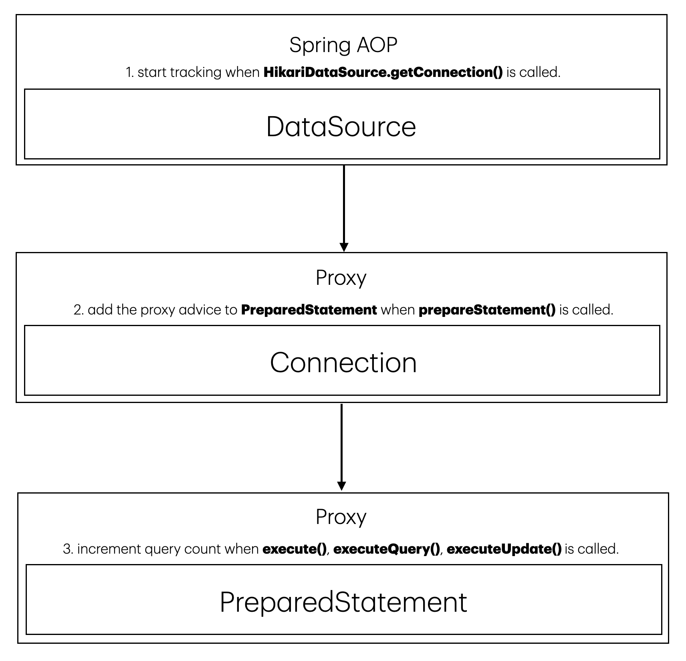

# 🖥️ Multi-DataSource Query Counter

## 🖥️ Introduction

This project is a simple tool to measuring query counts in a JDBC API environment.  
It is based on the Spring Data JPA framework and Spring AOP, CGLib proxy.

You can seamlessly measure query counts also in a Multi-DataSource environment.

```
Hibernate: 
    select
        id,
        name
    from
        example 
        
Hibernate: 
    select
        count(id) 
    from
        example
                 
WARN  [QueryCountLogger] - QueryCountPerRequest(apiUrl=GET /examples, totalQueryCount=2, totalQueryMilliSeconds=1)
```

<br>

## 🖥️ How to use?

### 1. Add dependency

### In Java Gradle(Groovy DSL)

```groovy
repositories {
    mavenCentral()
    maven { url 'https://jitpack.io' }
}

dependencies {
    implementation 'com.github.Hyeon9mak:multi-datasource-query-counter:1.0.1'
}
```

### In Kotlin Gradle(Kotlin DSL)

```kotlin
repositories {
    mavenCentral()
    maven { url = uri("https://jitpack.io") }
}

dependencies {
    implementation("com.github.Hyeon9mak:multi-datasource-query-counter:1.0.1")
}
```

### 2. Add logging options

The priority order is as follows: `error` > `warn` > `info`.  
The default value for `enable` is `false`, and the default value for `count` is `1`.

```yaml
query-counter.logging.level:
  error:
    enable: true
    count: 5
  warn:
    enable: true
    count: 2
  info:
    enable: false
```

### 3. Check the log

Start the application and check the log.

```
ERROR  [QueryCountLogger] - QueryCountPerRequest(apiUrl=GET /examples, totalQueryCount=23, totalQueryMilliSeconds=1)
```

Enjoy it! 🎉

<br>

## 🖥️ Core concepts



That's it!

<br>

## 🖥️ Recommended articles

(WIP)
